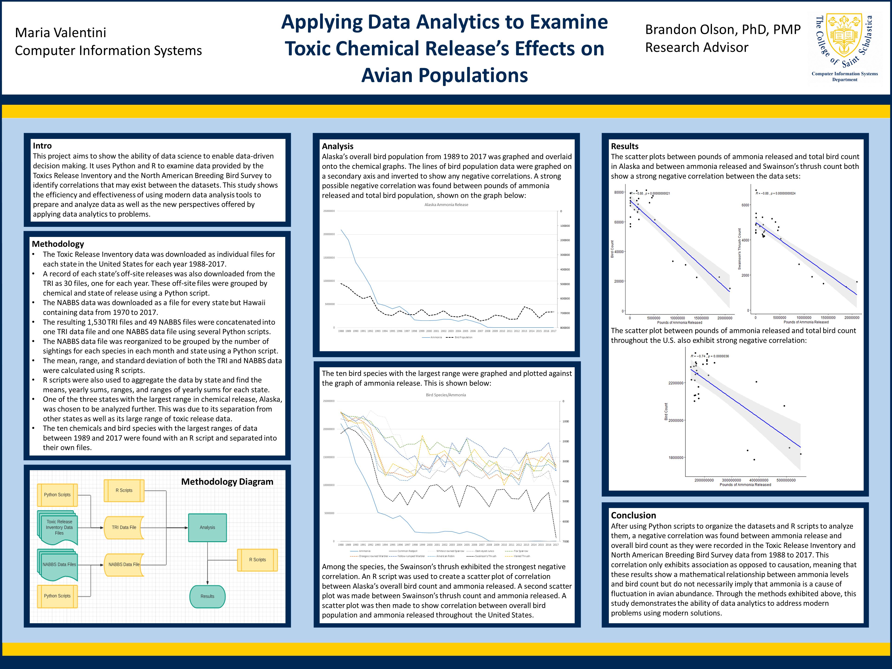
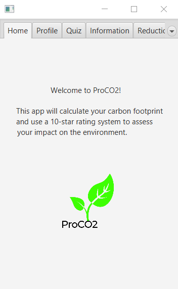
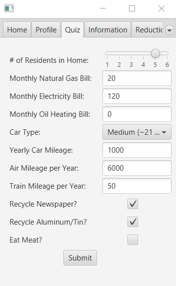
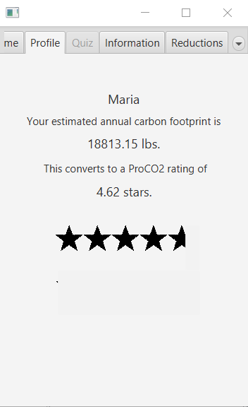
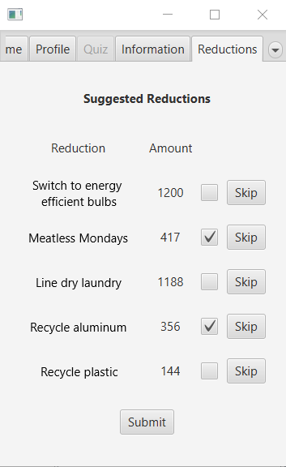

## 2019 Clare Boothe Luce Research Scholarship Project

A [link](https://drive.google.com/file/d/1Po2eSKMclfe4RKVSDbePbIKquasBlOKr/view?usp=sharing) to my project paper.

Poster (Presented at 2019 STARS Computing Corps Conference):

## 2020 ProCO2 Project for FORKaiA Internship

An application I developed for calculating and assigning scores to carbon footprints

      
